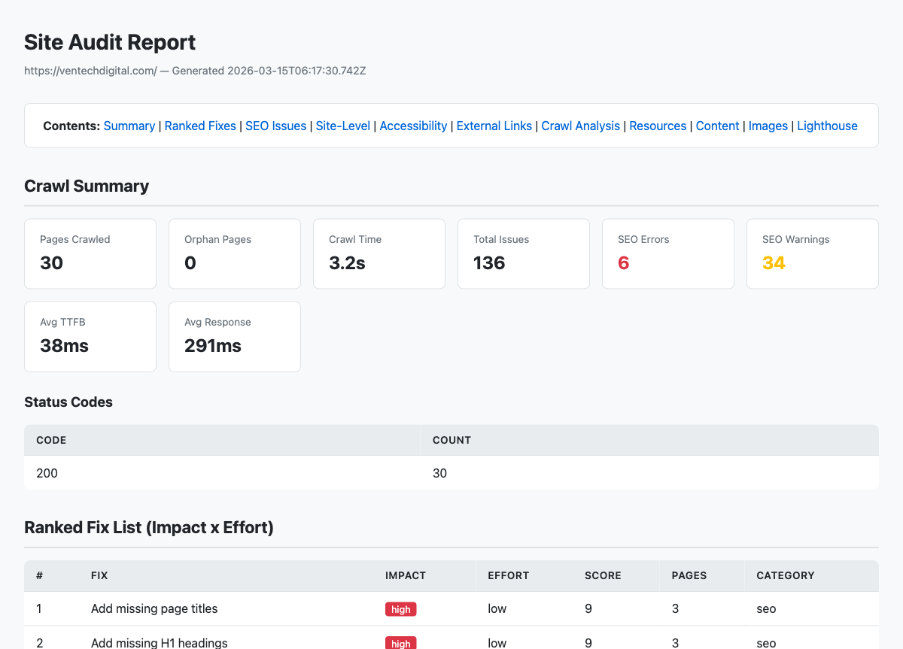
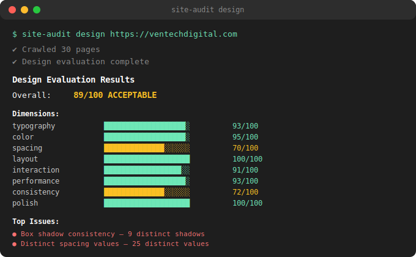

# site-audit

Comprehensive website auditing CLI. Crawls your site, runs 30+ SEO checks, evaluates design against a universal perfection standard, measures Core Web Vitals, and generates prioritized HTML reports with ranked fixes.





## Features

**SEO** — 20+ checks: titles, meta descriptions, headings, images, canonical tags, Open Graph, structured data, status codes, redirects, mixed content, thin content, duplicate detection

**Design Evaluation** (beta) — Scores visual design against an opinionated, non-configurable perfection standard across 8 dimensions: typography, color, spacing, layout, interaction, performance, consistency, polish

**Accessibility** — Form labels, ARIA landmarks, skip navigation, tabindex, heading hierarchy, lang attribute

**Performance** — Lighthouse CWV (LCP, INP, CLS), render-blocking scripts, image optimization, TTFB tracking

**Security** — HSTS, CSP, X-Frame-Options, X-Content-Type-Options header checks

**AI Analysis** — Claude-powered executive summary, per-page insights, and detailed fix instructions (requires `ANTHROPIC_API_KEY`)

## Install

```bash
npx @benven/site-audit audit https://example.com
```

Or install globally:

```bash
npm install -g @benven/site-audit
```

Or from source:

```bash
git clone https://github.com/eliBenven/site-audit.git
cd site-audit
npm install && npm run build
```

Optional: install Playwright for rendered crawling and design evaluation:
```bash
npx playwright install chromium
```

## Usage

### Full audit
```bash
site-audit audit https://example.com
```

### Design evaluation
```bash
site-audit design https://example.com
```

### Quick crawl
```bash
site-audit crawl https://example.com
```

### Key flags
```
--mode html|rendered    Crawl mode (default: rendered via Playwright)
--skip-lighthouse       Skip Lighthouse performance audit
--check-image-sizes     Check actual image file sizes via HEAD requests
--ai                    Enable AI analysis (requires ANTHROPIC_API_KEY)
--json                  Output JSON to stdout
--ci                    CI mode (plain text, no spinners)
--fail-on <severity>    Exit non-zero if issues exist (error|warning|info)
--pdf                   Generate PDF report
--depth <n>             Max crawl depth (default: 3)
--max-pages <n>         Max pages to crawl (default: 50)
--user-agent <string>   Custom User-Agent
--include <patterns>    URL patterns to include
--exclude <patterns>    URL patterns to exclude
--cookie <string>       Cookie string for authenticated pages
--no-robots             Ignore robots.txt
--retries <n>           Retries on transient failures (default: 1)
```

### CI integration
```bash
site-audit audit https://example.com --ci --fail-on warning
```

### Compare audits over time
```bash
site-audit history
site-audit diff report-before.json report-after.json
```

## Design Evaluation

The `design` command evaluates every page against a universal design perfection standard. No configuration — the spec defines what perfection looks like:

- **Typography**: modular scale, max 2 fonts, 16-21px body, max 8 distinct sizes
- **Color**: max 16 unique colors, WCAG AA/AAA contrast, no near-duplicates
- **Spacing**: 4px grid adherence, max 16 distinct values
- **Layout**: max-width set, no horizontal overflow, images dimensioned
- **Interaction**: 44px touch targets, visible focus indicators, 100-400ms transitions
- **Performance**: CLS = 0, font-display set, images prevent reflow
- **Consistency**: max 4 border-radius values, max 4 shadows
- **Polish**: favicon, alt text, no broken images

Score of 95+ = perfect. Below 75 = needs work.

## How it compares

| Feature | site-audit | Lighthouse | Ahrefs / SEMrush | Screaming Frog |
|---|---|---|---|---|
| SEO checks | 20+ rules | Basic | Comprehensive | Comprehensive |
| Design scoring | **Yes (0-100)** | No | No | No |
| Design system analysis | **Typography, color, spacing scales** | No | No | No |
| AI-powered insights | **Claude API** | No | AI content tools | No |
| Accessibility | HTML-based | Full audit | Limited | Limited |
| Performance (CWV) | Lighthouse integration | Native | Partial | No |
| Ranked fix list | **Impact x Effort** | Opportunities | Priority lists | No |
| Security headers | Yes | No | No | No |
| Self-hosted | **Yes, fully local** | Yes | No (SaaS) | Desktop app |
| CI/CD integration | `--fail-on`, `--json` | CI mode | API | No |
| Price | **Free / open source** | Free | $99-449/mo | Free / $259/yr |
| Design perfection standard | **Universal, opinionated** | No | No | No |

**The key difference**: site-audit is the only tool that defines a measurable success state for design. Other tools tell you what's broken — site-audit tells you when you're done.

## AI Analysis

Set your Anthropic API key and pass `--ai`:

```bash
ANTHROPIC_API_KEY=sk-ant-... site-audit audit https://example.com --ai
```

Generates an executive summary, per-page content quality analysis, and step-by-step fix instructions.

## Claude Code Skill

This tool is also available as a Claude Code slash command:

```
/site-audit https://example.com
```

This runs the full pipeline, verifies findings with Playwright MCP screenshots, and presents an actionable summary.

## Development

```bash
npm install
npm run dev          # Watch mode
npm run typecheck    # Type check
npm test             # Run tests (vitest)
npm run build        # Build
```

## Contributing

See [CONTRIBUTING.md](CONTRIBUTING.md) for development setup, coding standards, and PR process.

## License

MIT
